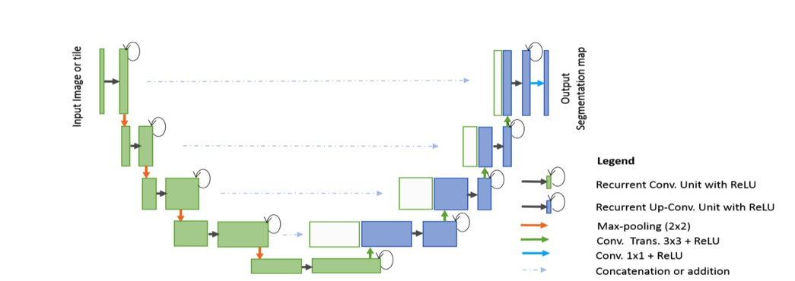

# R2U-Net : Medical Image Segmentation
 
## Introduction 

In this repository, we implement the R2U-Net network with the [Paddle](https://www.paddlepaddle.org.cn/) framework. Our model achieves F1-score 0.8232 on DRIVE dataset.  

- Original Paper : [Recurrent Residual Convolutional NeuralNetwork based on U-Net (R2U-Net) for Medical Image Segmentation](https://arxiv.org/pdf/1802.06955.pdf)  
- Dataset : [DRIVE](https://drive.grand-challenge.org)  

## R2U-Net
The proposed
models utilize the power of U-Net, Residual Network, as well as
RCNN. There are several advantages of these proposed
architectures for segmentation tasks. First, a residual unit helps
when training deep architecture. Second, feature accumulation
with recurrent residual convolutional layers ensures better feature
representation for segmentation tasks. Third, it allows us to design
better U-Net architecture with same number of network
parameters with better performance for medical image
segmentation.  
  

## Experiment Results

|                          |    F1-score    |  sensitivity | specificity | accuracy | AUC |  
| ------------------------ | -------------- |  --------|  -------|  ------| -----|  
| Original Paper's Results | 0.8171          | 0.7792| 0.9813 | 0.9556 | 0.9782 |  
| Ours Results             | 0.8232     | 0.8164 | 0.9763 | 0.9557 | 0.8963 |  


## Train & Test

To train the model yourself, run :  
```
python main.py --model R2U-Net --mode train 
```
To test the results with the model we provided :
```
python main.py --model R2U-Net --mode test
```  
Other Parameters:  
`--dataset_path` : path to dataset  
`--result_path` : path to save results  
`--epoch` : training epochs  
`--batch_size`: batch size  
`--lr` : learning rate  
`--show` : show the testing results (default: False)

## AI studio link

* [https://aistudio.baidu.com/aistudio/projectdetail/2563854](https://aistudio.baidu.com/aistudio/projectdetail/2563854)


